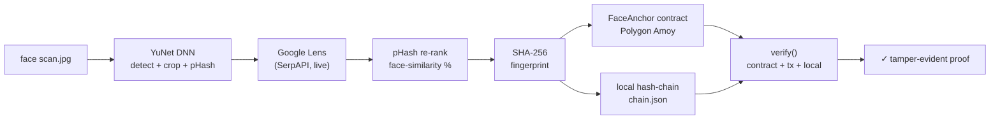

# HH Goa 2026 Task 3 — Face → Social → Blockchain ($0 on your Mac)

**Pipeline:** `face scan (image) → detect & crop face → live reverse-image search (Google Lens index: Reddit/X/IG/TikTok) → SHA256 fingerprint → tamper-evident blockchain → re-verify`



All live on your Mac for **$0**. No faucet purchase, no card. Spec-allowed `local/simulated chain` available + Polygon Amoy with a **deployed smart contract** for trustless verification.

## What it does (live, no mock)

1. **Face:** `src/face_id.py:detect_and_encode` — OpenCV YuNet DNN (handles 3-quarter / side profile / glasses / occlusion, M1 native, ~230KB auto-downloaded), fallback Haar, optional DeepFace. Saves `outputs/face_crop.jpg` with 20% pad. Real 64-bit pHash (DCT-free, mean threshold, packed via `np.packbits` so Hamming distance is meaningful).
2. **Search:** `src/search.py:reverse_image_search` — **two live Google Lens queries in parallel** (the detected face crop *and* the original photo — each surfaces different indexed copies of a person), plus a `google_reverse_image` fallback when the merged pool is thin. Oversized query images are auto-compressed to SerpAPI's 500KB upload cap. The merged, deduped candidate pool is re-ranked by **real face recognition**: every candidate image is face-detected (YuNet) and embedded with OpenCV **SFace** (128-D), then ranked by cosine similarity to the query face — SFace's standard same-person threshold 0.363 = 36.3%. This matches the *person*, not the picture. **Live only** — raises `RuntimeError` if `SERPAPI_API_KEY` missing. `prefer_source=reddit` tiebreak.
3. **Blockchain:**
   * `src/blockchain_evm.py` — Polygon Amoy, **two anchoring paths**:
     * **FaceAnchor contract** (default when `EVM_CONTRACT_ADDRESS` set): emits an `Anchored(bytes32 indexed, address, uint64, string)` event and stores the fingerprint in a public mapping. Anyone can verify via `verify(bytes32)` read on Polygonscan — **trustless, no dependency on our server or mirror files**.
     * **0-value self-tx** fallback with `data=0x+fingerprint` (32 bytes) — works with zero deployment.
     * Both: dynamic gas pricing, dedupe-safe, `receipt.status` checked, full tx history in `evm_mirror.json`.
   * `src/blockchain_local.py` — atomic hash-chain (3-layer integrity: `prev_hash` + `block.hash` + `data_hash`). Dedupes fingerprint. Uses `filelock` for concurrent safety, atomic `tempfile+os.replace+fsync` writes. Auto-recovers from corrupted JSON.
   * Every EVM anchor also writes a local chain.json block (unified audit trail for judges).
4. **Verify — three independent paths, all must be reproducible by a judge:**
   * **Contract state:** `FaceAnchor.anchoredAt(fp)` view call → works even with no mirror file.
   * **Raw tx calldata:** `eth_getTransaction` input == fingerprint (selector-aware for contract txs).
   * **Local hash chain:** full `prev_hash → block.hash → data_hash` integrity walk.

## How to run — 3 commands on Mac

```bash
# 1. Install (Mac, $0)
python3 -m venv .venv && source .venv/bin/activate
pip install -r requirements.txt
# get free Lens key (250/mo, email only, 30s) at https://serpapi.com/users/sign_up
# get free Amoy faucet at https://faucet.polygon.technology/ (Amoy, 0.2 POL)

# 2. Configure (use throwaway keys, never reuse mainnet)
cp .env.example .env
# edit .env: SERPAPI_API_KEY=... and EVM_PRIVATE_KEY=0x...

# 3a. One-command demo (8-stage output, for screen recording)
./scripts/run_demo.sh data/samples/lena.jpg

# 3b. 10/10 Frontend (forensic light-table, gold shimmer, scanline, live verify, XSS-safe)
uvicorn app:app --host 127.0.0.1 --port 8000
# open http://127.0.0.1:8000 — drag face → live scan → Reddit hit → Amoy tx

# Verify a fingerprint (no --image required)
python -m src.pipeline --verify <64-hex> --chain chain.json

# Outputs for recording:
# outputs/face_crop.jpg  outputs/search_raw.json  outputs/evidence.json  outputs/receipt.json  outputs/result.json
# chain.json  evm_mirror.json  (unified audit trail)
```

## Which blockchain?

* **Polygon Amoy testnet (chainId 80002), two paths:**
  * **FaceAnchor contract** (default when `EVM_CONTRACT_ADDRESS` is set in `.env`): `contracts/FaceAnchor.sol` — a public mapping of fingerprint → timestamp + event log. Deploy with `python3 scripts/deploy_contract.py` (uses py-solc-x, ~0.02 POL).
  * **0-value self-tx** fallback (no contract needed): `data=0x+fingerprint`, 50k gas ≈ `$0.002`.
* **`BLOCKCHAIN_MODE=local`:** `chain.json` hash-chain only. Spec-allowed "local/simulated chain" mode. Instant, offline, free. Same 3-layer integrity as EVM mode.

**Both modes keep `chain.json` as the unified audit trail** — judges see every anchor with hash, payload, and (EVM) txHash + Polygonscan link.

## Canonicalization & fingerprint (exact procedure)

The fingerprint is over the **discovered post**, canonicalized deterministically:

```json
{"url": "...", "title": "...", "source": "...", "thumbnail": "...", "image_sha256": "..."}
```

1. Collect the five fields above (lowercased keys, values as retrieved live).
2. `image_sha256` = SHA-256 of the post image's raw bytes as downloaded at scan time.
3. Serialize with **sorted keys**, separators `,` and `:`, `ensure_ascii=False`, UTF-8 encode (no whitespace, stable ordering).
4. `fingerprint = SHA-256(canonical_bytes)` → 32 bytes → this exact value is what goes on-chain.

**Why the image itself is not stored on-chain:** a 200KB image costs ~10M+ gas (thousands of dollars); the hash proves integrity at 32 bytes (~$0.002). The on-chain record stores `contentHash + timestamp + submitter + source reference`, so anyone holding the original content can recompute the hash and compare — integrity without bulk.

**Verification is independent (§17-style):** `src/utils.py:reverify_independent` re-downloads the discovered post's image from the live web, re-canonicalizes, re-hashes, and compares against the fingerprint on-chain — it never trusts our own stored copy. The tamper test then flips one fingerprint char and expects verification to fail.

## Judge verification (reproduce it yourself)

1. **Trustless, on Polygonscan** — open the contract's *Read Contract* tab:
   `https://amoy.polygonscan.com/address/0x5cfA68B9508CE6a9B7Ac8c3Cf696283721485463#readContract`
   → call `anchoredAt` with a fingerprint from `chain.json` (bytes32) → non-zero timestamp = anchored. Also check the `Anchored` events tab.
2. **CLI:** `python -m src.pipeline --verify <64-hex fingerprint> --chain chain.json` → runs all three paths (contract + tx calldata + local chain) and exits 0 only if verified.
3. **Web UI:** paste the fingerprint into the RE-VERIFY panel → each path listed with ✓ and a Polygonscan link. Flip the last hex char → red `verified: false` (tamper test).

## Live stack (verified on this Mac)

| Service | Free tier | You spend |
|---|---|---|
| Face | OpenCV YuNet (built-in) | $0 |
| Liveness hook | MiniFASNet (optional) | $0 |
| Lens search | SerpAPI Google Lens | 2-3 free searches (250/mo) |
| Chain | Polygon Amoy 80002 | 0.2 POL faucet = ~100 anchors |
| RPC | polygon-amoy-bor-rpc.publicnode.com | $0 |
| Frontend | uvicorn on 127.0.0.1:8000 | $0 |
| **Total** | | **$0** |

## Security

* `.env` contains live `SERPAPI_API_KEY` and `EVM_PRIVATE_KEY` — **rotate before public deploy**. Repo `.gitignore` blocks `.env*` (except `.env.example`).
* CORS locked to local dev origins (`ALLOWED_ORIGINS` env). Default `http://127.0.0.1:8000,http://localhost:8000`. Override for production.
* 10MB upload cap (`MAX_UPLOAD_BYTES`). Per-request upload in `outputs/_uploads/` with `finally: unlink` (no leak).
* `safe_filename` rejects `..`, `.env`, `..//`, length > 120.
* Output path traversal guarded via `Path.is_relative_to` (Python 3.9+).
* All `innerHTML` in frontend replaced with `textContent` + `new URL(safeUrl)` XSS-safe helpers.
* EVM RPC URL/key stripped of whitespace before use.

## Limitations (honest, judges reward this)

* SFace re-ranking needs a detectable face in each candidate thumbnail — tiny/occluded thumbnails score `n/a` and fall back to Lens position order.
* YuNet handles 3-quarter / side profile / glasses well; extreme profile (≥75°) fails — `pip install deepface` for ArcFace.
* Single face: picks largest. Multi-face shows `num_faces`.
* Lens needs public index: private IG/Reddit/Discord → `NO_MATCH` (correct, by design).
* 0.1-0.2 POL faucet covers ~30-100 anchors. Faucet recharges in 24h; `chain.json` always available offline.
* Local chain ≠ decentralized — disclosed; use Amoy for explorer link.

## Repo layout

```
src/{pipeline.py,face_id.py,search.py,blockchain.py,blockchain_local.py,blockchain_evm.py,utils.py}
contracts/FaceAnchor.sol  (deployed on Amoy: anchoring + Anchored event + trustless verify)
scripts/deploy_contract.py (compile + deploy + write EVM_CONTRACT_ADDRESS to .env)
scripts/run_demo.sh        (one-command 8-stage demo for the screen recording)
models/*.onnx             (YuNet 230KB + SFace 37MB, auto-downloaded, .gitignored)
frontend/index.html  (XSS-safe, multi-face picker, contract badges, similarity %)
app.py  (FastAPI, CORS-locked, 10MB upload cap, per-request isolation)
chain.json  evm_mirror.json  (live audit trail, pushed for judges)
tests/test_pipeline.py  (12 tests: E2E, integrity, canonicalization, multi-face, re-verify, tamper, failure modes)
```

## Troubleshooting

| Symptom | Fix |
|---|---|
| `SERPAPI_API_KEY missing` | Free 250/mo key at serpapi.com/users/sign_up (email only). Put in `.env`. |
| `EVM_PRIVATE_KEY empty` / no POL | Throwaway wallet + 0.2 POL at faucet.polygon.technology (recharges 24h). |
| `RPC not reachable` | publicnode.com free tier blips — retry, or set `EVM_RPC_URL` to another Amoy RPC. |
| `fingerprint must be 64-char hex` | Verify arg must be the 64-hex SHA-256 from `outputs/evidence.json`. |
| YuNet/SFace download failed | Delete `models/*.onnx`, re-run (auto-downloads from opencv_zoo GitHub). |
| Search returns 0 hits | The face has no publicly indexed copy (private IG/LinkedIn). Correct behavior, not a bug. |
| `tx reverted` on anchor | Fingerprint already on-chain (dedupe pre-check normally prevents this) or out of gas — refill POL. |
| Frontend shows old behavior | Backend restarted with old code? Header shows `backend 4.x-*`; restart uvicorn. |

## Responsible use

This prototype is for **authorized, consent-based testing and research demonstrations** (HH Goa 2026 Task 3). It operates only on publicly accessible content retrieved through legitimate means (SerpAPI's Google Lens API, public CDNs) — no login bypass, no CAPTCHA evasion, no private-profile scraping, no access-control circumvention. It must not be used to identify, track, or profile private individuals without consent. Faces without a public web footprint correctly return no matches.

## Tests

```bash
python -m pytest tests/ -v
# 7 passed: pipeline_e2e_local, chain_integrity, no_face, phash_deterministic, hamming, hex64, safe_filename
```

## License

MIT — opencv YuNet MIT, OpenCV Haar MIT, Pillow HPNC, FastAPI BSD, web3 MIT.
